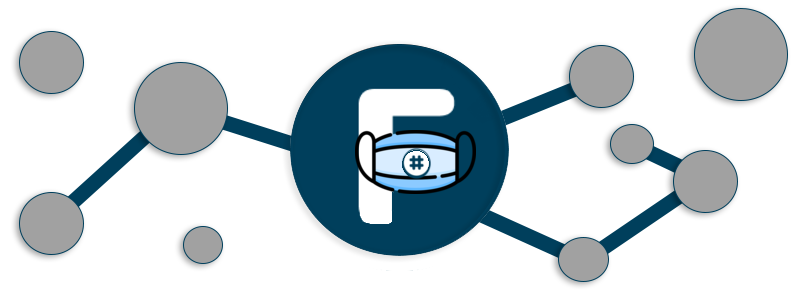

[](https://www.nuget.org/packages/FaissSharp)
[](https://www.nuget.org/packages/FaissSharp)

# FaissSharp

FaissSharp is a package that wrap the c_api of [faiss](https://github.com/facebookresearch/faiss)

Faiss is a library for efficient similarity search and clustering of dense vectors. It contains algorithms that search in sets of vectors of any size, up to ones that possibly do not fit in RAM. It also contains supporting code for evaluation and parameter tuning. Faiss is written in C++ with complete wrappers for Python/numpy. Some of the most useful algorithms are implemented on the GPU. It is developed by [Facebook AI Research](https://research.fb.com/category/facebook-ai-research-fair/).

This version is based on faiss v1.6.0 and only tested with net core 3.0 stable release

Test the latest changes checking out the `develop` branch

## Try it

The `examples` directory contains multiple demo console projects.

```
$ cd examples/IndexFlatL2
$ dotnet run
Generating 100000 vectors with sequential ids from 0 to 99999...
Building index
IsTrained True
Elements in index: 100000
Searching...
    0 (d=.000)  80114 (d=12.777)  18048 (d=12.990)  52321 (d=13.222)  79890 (d=13.319)  
    1 (d=.000)  25899 (d=11.786)  79029 (d=12.427)   6031 (d=13.072)  92770 (d=13.113)  
    2 (d=.000)  72548 (d=12.692)  70736 (d=13.224)  22462 (d=13.433)  81400 (d=13.535)  
    3 (d=.000)  60856 (d=13.894)  52172 (d=13.956)  33453 (d=14.347)  71529 (d=14.637)  
    4 (d=.000)  57473 (d=13.139)  63244 (d=13.259)  42473 (d=13.394)  52208 (d=13.422) 
```

## Implemented classes

* `Index`
* `IndexFlat`
* `IndexFlatL2`
* `IndesIDMap`

## Implemented functionality

* Add
* Add with ids (only `IndexIDMap`)
* Count (`ntotal`)
* Search
* Free (to release unmanaged memory allocations)

## TODO
- [x] Nuget Package
- [ ] Logging
- [ ] Tests
- [ ] Sync native functions with faiss c_api

> This is an active project, but MR are welcome.

## License
FaissSharp is MIT-licensed.